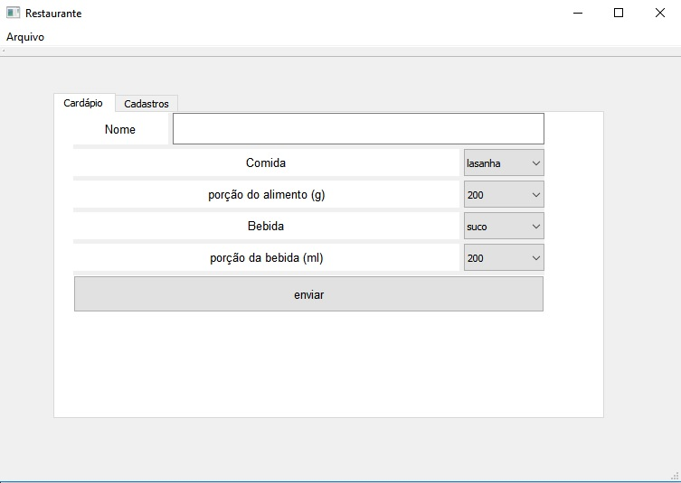
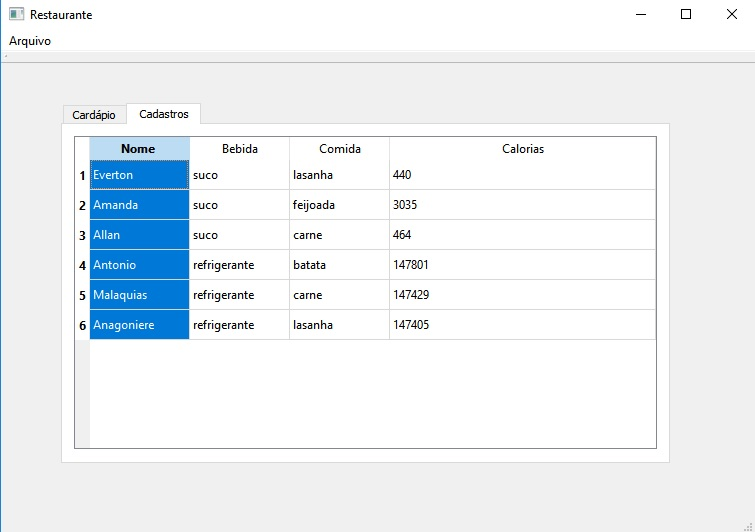

# Primeiro Projeto utilizando QT Creator
### Aplicação desenvolvida em [QT](http://www.qt.io) para gerenciar o cadastro de pacientes para consultorio de nutrição e restaurante associados

A aplicação permite que o usuário insira vários clientes de um restaurante, ou paciente de um consultorio de nutrição, e os mostre em uma tabela. O usuário - o cliente de um restaurante que usa esta aplicação, ou um proficional nutricionista que busca uma dieta para seus pacientes considerando as calorias dos alimentos, - tem a possibilidade de adicionar o nome, a sua opção de comida e sua quantidade em gramas (g), a sua opção de bebida e sua quantidade em mili litros (ml); Como retorno, é feita uma ordenação por ordem de cadastro e devolvido na tabela a quantidade de calorias total - as somas calóricas do alimento e bebida escolhidos no momento do cadastro - assim como as opções escolhidas inicialmente no cadastro. A Figura abaixo mostra a tela inicial da aplicação.

O gerenciador de pacientes/clientes também conta com uma aba para mostrar os cadastros efetuados.

Ficha Técnica:  ;

Instituto Federal da Paraíba  ;
Aluno: Everton Júnior Da Silva Arruda ;
Professor: Patric Lacouth ;
Curso: Engenharia Elétrica  ;

Descrição:
Projeto desenvolvido em QT Creator para a disciplica de Técnicas de Programação.

